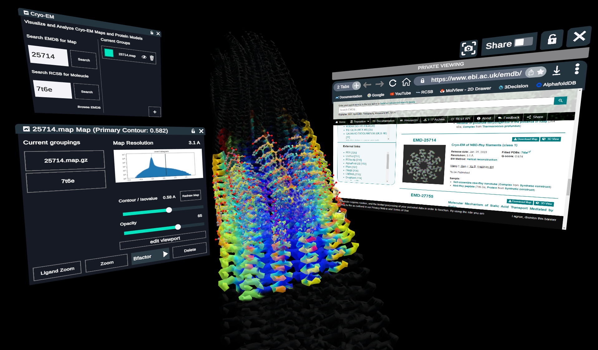

# Nanome - Cryo-EM

Nanome plugin to load Cryo-EM maps and display them in Nanome as surfaces


## Dependencies
The plugin is built on top of Computational Crystallography Toolbox ([cctbx](https://cci.lbl.gov/docs/cctbx/))

## Usage
To run Cryo-EM in a Docker container:

```sh
$ cd docker
$ ./build.sh
$ ./deploy.sh [run_args]
```

### Environment Variables

Use the following environment variables to configure the plugin:

`NTS_HOST` - Sets the Plugin Server host<br>
`NTS_PORT` - Sets the Plugin Server port<br>
`NTS_KEY` - Specifies a key file or key string to use to connect to NTS<br>
`PLUGIN_NAME` - Optional custom name to display in the Nanome stacks Menu <br>
`PLUGIN_VERBOSE` - Enable verbose mode, to display Logs.debug<br>
`VAULT_URL`: URL to use for Vault Integration<br>
`VAULT_API_KEY`: API Key access Vault.<br>
`MAX_MAP_SIZE`: Maximum size of map to load (in MB). Default: 350MB)<br>

## License

MIT
